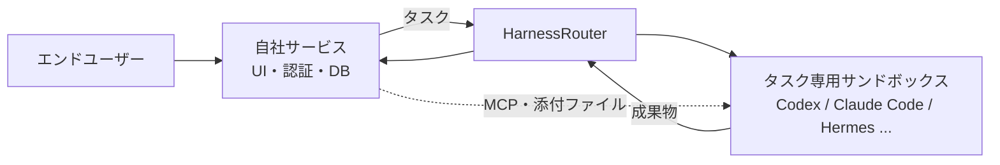

HarnessRouter は、Codex や Claude Code、Hermes といったエージェントハーネスを、自社サービスの裏側で 1 本の API から動かすための中継基盤です。この記事では、普段 Hermes Agent を VPS に常駐させて利用している私が、公式情報を読み解く中で感じた疑問を順に紐解きながら、何がうれしいのか、どのような場面で効果を発揮するのかを整理します。

:::message
- 対象読者は、Claude Code / Codex / Hermes Agent などを実務で使っていて、「ハーネスを切り替えられる」というメリットがいまひとつ腑に落ちていない方です。
- 内容は 2026-09-23 時点の公式サイト・ドキュメント・料金ページ・GitHub・UHP 仕様・Show HN のスレッドを読んで整理したものです。**HarnessRouter を実際に動かしての検証は行っていません**。
- この分野は動きが速いため、導入前に公式の最新情報をご確認ください。
:::

## 結論 ─ エージェントを「製品の部品」にする層

先に結論からお伝えします。

- HarnessRouter は、**エージェントを自分自身が使うツールとしてではなく、自社サービスのエンドユーザーに向けて動かすための実行基盤**です。
- 開発者自身の言葉を借りれば「OpenRouter のハーネス版」です。OpenRouter が複数のモデルを 1 つの API に集約したのと同様のことを、エージェントハーネスに対して行っています。
- ハーネスを自由に差し替えられるのは、**記憶や知識をハーネスの外部に配置する設計**をとっているためです。ハーネス間で共有されるメモリは存在しません。
- 自身の個人作業で Claude Code や Hermes を使うだけであれば不要です。効いてくるのは、自社サービスの「ボタンの裏側」でエージェントを動かす場面です。

ここで言う「ハーネス」とは、LLM に対して作業場（サンドボックス）・ツール・実行ループを提供し、単なるテキストトークンではなく「タスクの成果」を返せるようにする仕組みを指します。GPT-5.5 や Claude Sonnet が「モデル」であり、Codex や Claude Code が「ハーネス」にあたる、という区別です。

## 最初に誤解したこと ─ 常駐エージェントの親戚ではない

公式サイトを最初に読んだ際、私は HarnessRouter を「クラウド上で常時起動し、ハーネスを切り替えながらループを自律的に回し続ける基盤」だと理解していました。普段から Hermes を常駐させている立場からすると、その延長線上にあるシステムに見えたためです。

しかし、この認識は誤りでした。HarnessRouter は、**リクエストを受け取ったときだけタスク専用のサンドボックスを 1 つ立ち上げ、作業を終えたら結果を返して破棄する**仕組みです。エージェントのループはそのサンドボックス内でハーネス自身が回しており、HarnessRouter 自身が複数のハーネスを跨いでループを制御しているわけではありません。セッションを続きから再開することは可能ですが、エージェントが自律的に思考して常時動き続けることはありません。今回ドキュメントを読んだ範囲では、cron のような定期実行機能も見当たりませんでした。

Hermes と比較すると、両者の役割の違いが明確になります。

| | Hermes Agent（常駐運用） | HarnessRouter |
|---|---|---|
| 対象ユーザー | 持ち主 1 人 | 自社サービスのエンドユーザー（多数） |
| 動作形態 | 常駐して記憶を保持し、自走する。定期実行も可能 | リクエストごとに起動し、結果を返して終了する |
| 例えるなら | 住み込みの専属秘書 | 派遣会社の窓口。依頼 1 件ごとに個室と担当者を手配し、成果物を納品したら部屋を片付ける |
| 切り替え可能な要素 | モデル | ハーネスとモデルの両方 |

両者は競合する関係ではありません。Hermes は、HarnessRouter の内部で選択可能なハーネスの 1 つでもあります。

## ハーネスとモデルは別の軸

「モデルを自由に切り替えられる Hermes があれば十分なのでは」と最初は考えました。しかし、公式ベンチマークを確認すると、**モデルを固定したままハーネスだけを変更しても、コストと処理速度が変わる**ことが分かります。

公式が公開している「Care Prep」ベンチマーク（合成データを用いた同一タスク）から、同一モデル同士の比較データを抜粋したものが以下の表です。

| モデル | ハーネス | 所要時間 | コスト（credits） |
|---|---|---|---|
| gpt-5.2 | Hermes | 2 分 33 秒 | 0.47 |
| gpt-5.2 | Codex | 4 分 36 秒 | 0.72 |
| gpt-5.5 | Hermes | 1 分 25 秒 | 40.7 |
| gpt-5.5 | Codex | 2 分 46 秒 | 59.7 |
| claude-sonnet-4.6 | Hermes | 2 分 49 秒 | 39.6 |
| claude-sonnet-4.6 | Claude Code | 1 分 31 秒 | 83.5 |
| claude-opus-4.8 | Hermes | 2 分 42 秒 | 150 |
| claude-opus-4.8 | Claude Code | 3 分 18 秒 | 223 |

公式の集計によると、ハーネスのみを変更した場合でも、コストは 1.5〜2.1 倍、所要時間は最大 1.95 倍（gpt-5.5 の 2 行）の差が生じています。特に Sonnet の行が分かりやすい例です。Hermes のほうが安価に完了している一方で、Claude Code のほうが高速に処理を終えています。同じ「頭脳（モデル）」を採用していても、プロンプト指示の組み立て方、利用するツール、ループの回し方、コンテキストの切り捨て方などが異なれば、実行結果も変わるということです。

Hermes 単体でモデルを切り替える運用は、これら 2 つの軸のうち片方だけを動かしている状態です。タスクの進め方自体は Hermes 流に固定されているためです。

ただし、このベンチマークは提供元が実施した単一タスクの計測結果に過ぎません。公式ドキュメントでも「一般化できる最大値ではない」と注記されています。これらの数値は、あくまで傾向を把握するための参考材料として捉えるのが妥当です。

## 切り替えの価値は常用ではなく保険

ここで次のような疑問が浮かんできます。ハーネスごとに性能差があることは理解できても、「自由に切り替えられること」自体のメリットは、まだ見えていませんでした。

Show HN のスレッドでも、まさにこの疑問が投げかけられていました[^hn]。「コーディング用のハーネスを複数使い分ける理由が分からない」という質問に対し、開発者の回答は、コーディングなら自分も 1 つ（Claude Code）に絞っている、というものでした。その上で、HarnessRouter が必要になるのは、ハーネスを自社サービスのバックエンドに組み込み、エンドユーザーへ提供するときであると説明しています。

つまり、日常的にハーネスを頻繁に切り替えて使うこと自体は、主要なユースケースとして想定されていません。私の理解では、切り替えの価値は 2 点に集約されます。

1 点目は、**将来の乗り換えに対する保険**です。ここでの切り替え単位は、リクエストごとではなく「機能単位」です。公式ドキュメントでは、サーバー側に「機能 → 設定済みハーネス」の対応表を保持する構成を推奨しています。

```ts:server/harness-map.ts
const harnessByFeature = {
  contract_review: "chrn_...",
  game_generation: "chrn_...",
};

const harnessId = harnessByFeature[featureKey];
```

将来より安価な、あるいはより強力なハーネスが登場した際にも、この対応表を 1 行書き換えるだけで、それ以降のタスクを新しいハーネスで実行できます。特定のハーネスに依存・ロックインされないための保険となります。

そして 2 点目が、本質的な価値だと考えています。それは、**ハーネスを運用するための周辺機能を自前で作らずに済むこと**です。自社サービスの中でエージェントを稼働させようとすると、以下のような機能が不可欠になります。

- エンドユーザーごとの環境隔離（A さんのファイルが B さんから見えないこと）
- 多数のユーザーが同時に利用した際の並行実行制御
- クライアント（ブラウザ）への進捗状況の逐次ストリーミング配信
- 処理の途中キャンセルや、失敗時の中断箇所からの再開
- タスク単位でのコスト計測

Hermes は単一のユーザーによる利用を前提として設計されているため、これらを Hermes で実現しようとすると、すべてを自前で実装しなければなりません。HarnessRouter は、こうした複雑な基盤機能を一手に肩代わりしてくれます。「ハーネスを切り替えられる」という機能は、マルチテナントに対応した共通のプラットフォーム（器）を構築した結果として、自然と備わった副産物であると捉えると、腑に落ちました。

## 記憶はハーネスの外に置く

ハーネスの切り替えが前提であるなら、ハーネス間で横断して共有できるメモリ領域があるのではないか、というのも私が疑問に感じた点でした。

結論から言うと、共有メモリは存在しません。UHP（Unified Harness Protocol：HarnessRouter が公開しているサービスとハーネス間の共通仕様）では、セッションの継続条件として「同一の作業ディレクトリ・同一の会話コンテキスト・**同一の設定済みハーネス**」であることが規定されています[^uhp]。つまり、1 つのセッションは特定のハーネスに固定されます。会話セッションの途中でハーネスを切り替えてコンテキストを引き継ぐような仕組みは、現時点では用意されていません。Show HN で開発者は、フォールバックと文脈の引き継ぎの両方を「良いユースケース」と認めつつ、フォールバックはスマートルーティング機能として「ロードマップにある」と説明するにとどまっています。

エージェントの「記憶」を保持する場所は、ハーネスの外部、すなわち「自社サービス側」です。



| 引き継ぎたい情報 | 配置場所 | 別のハーネスへの受け渡し方法 |
|---|---|---|
| 業務知識・作業手順 | 指示文（プロンプト）・スキル | 設定済みエージェントごとに登録する |
| 顧客データ・過去の履歴 | 自社サービスのデータベース | MCP 経由で接続するか、タスクごとにファイルとして添付する |
| 前回のタスクの成果物 | セッション内のファイル | 一度ダウンロードし、次のタスクに再度添付する |

このアーキテクチャは、Web アプリケーション開発ではなじみ深いものです。The Twelve-Factor App で提唱されている「プロセスはステートレスとして扱い、永続化が必要なデータはバッキングサービスに格納する」[^12factor] という原則と同じ形です。アプリケーションサーバーを容易に差し替えたりスケールアウトさせたりできるのは、状態（ステート）を外部に出しているからです。HarnessRouter におけるハーネスも同様で、**記憶を持たないからこそ差し替えられる**のです。これは公式ドキュメントに直接書かれている言葉ではなく私の解釈ですが、この視点を持つことでシステム全体の構造を明快に理解できるようになりました。

裏を返せば、Hermes の大きな強みである「使い込むほどにエージェントの記憶が蓄積され成長していく」という恩恵は、HarnessRouter 上では得られません。料金プランに記載されている「エージェントメモリ」（ベータ機能）も、作業履歴や生成された成果物を一時的に保管するための短期ストレージであり、エージェント自身を成長させるための長期記憶の仕組みではない点に留意する必要があります。

## 切り替えコストの 3 段階

一般に「切り替えコストは低い」と説明されがちですが、細かく分解してみると、容易な部分とそうでない部分が存在します。

**コードの切り替えコストは低めです。** 前述した通り、自社サービス側で実装するコードに関しては、対応表を 1 行書き換えるだけで完結します。API インターフェースの形式自体は変化しません。UHP は OpenAI Responses API との互換性を持つため、既存の SDK やストリーミング処理の実装コードもそのまま再利用可能とされています。

**設定のつなぎ直しには中程度の手間がかかります。** エージェントに与える知識の実体はハーネスの外部に存在するため、知識自体をゼロから再構築する必要はありません。新しい設定済みエージェントに対して、同一の MCP やスキルを再登録する作業となります。ただし、すべてのハーネスがあらゆる機能に対応しているとは限りません。UHP には、各ハーネスの実装側が「未対応の機能」を申告する capability discovery（機能検出）の仕様が存在します。そのため、MCP やスキルに対応していないハーネスへ乗り換えた場合、その機能は利用できなくなります。また、システムプロンプト等の指示文も、文面が同一であってもハーネスごとに解釈や挙動が異なるため、実運用ではプロンプトの微調整が必要になる場面が多いはずです。

**成果物の品質検証は毎回しっかりと行う必要があります。** 新しいハーネスに切り替えても従来と同水準の成果物が得られるかどうかは、代表的なタスクを繰り返し実行して地道に確認するほかありません。公式ドキュメントにおいても、本番環境の経路で期待通りの結果が一貫して返ることを確認した上で切り替えることが推奨されています。こうした検証サイクルを円滑に進めるため、複数の構成を並行してテストできる「Harness Arena」や、詳細な実行記録を追跡できるトレース機能が提供されています。

## 起動は重くないのか

タスクを実行するたびにサンドボックスを都度立ち上げると聞くと、起動オーバーヘッドによる遅延、とりわけ初回のレイテンシが懸念されます。

環境の起動に要する具体的な秒数は公式には公表されていません。ただし、公式ドキュメント自身がトレース機能で注視すべき指標として「slow startup（起動の遅延）」を挙げていることから、起動に伴う遅れが発生すること自体は仕様上想定されています。

それでも、大半の実用ユースケースにおいては大きな問題にならないと考えられます。公式ベンチマークにおける全体の所要時間は、サンドボックスの起動時間を含めて 1 分 25 秒〜4 分 36 秒でした。一般的なクラウド環境において、事前ビルドされたコンテナイメージから立ち上がるモダンなサンドボックスは数秒程度で起動するものが多く（HarnessRouter が採用しているインフラ基盤は非公開）、仮に数秒を要したとしても全体の処理時間の数％程度に収まります。また、処理の進捗は逐次ストリーミング配信されるため、フロントエンドの画面上に「準備中」「実行中」といったステータスを表示して、待ち時間の体感を和らげられます。

一方で、数秒以内での即答性が求められる通常のチャットボットのような用途には適していません。もっとも、その場合のボトルネックはコンテナの起動時間ではなく、エージェントが自律的に調査やツール実行を繰り返す処理そのものにあります。そうした即時応答が求められる用途であれば、エージェント基盤を介さずに LLM の API を直接呼び出すアーキテクチャのほうが適しています。

なお、懸念される「初回起動」については、以下の 3 つの側面に整理できます。

| 場面 | 発生する処理 |
|---|---|
| OSS 版の初回起動時 | 有効化したハーネスの CLI ツール群がインストールされます。これらは Docker ボリューム内にキャッシュされるため、タスクごとに再インストールが発生することはありません。 |
| クラウド版でタスクを依頼するたび | タスク専用のサンドボックス環境が都度プロビジョニングされます（所要秒数は非公開）。料金ページによると、基盤の処理能力を超えた場合もエラーにはせず、短いキュー待ちになります。 |
| 同一セッションの続きを実行するとき | 同一の作業ディレクトリ環境から処理を再開できることが仕様で保証されています（サンドボックスを稼働させたまま待機するのか、ストレージから状態を復元するのかは非公開です）。 |

## 使いどころ

エンドユーザーが画面上でボタンをクリックし、バックエンドでエージェントが数分間かけて自律的に作業を行い、最終的な成果物を返す。このようなワークフローを持つ機能が主な適用対象となります。具体的なユースケースの例を以下に挙げます。

| 想定ユースケース | 具体的な処理内容 |
|---|---|
| AI ツールの比較・調査サイト | 利用者が希望条件を入力すると、エージェントが Web 上を探索・調査し、比較表をファイル形式で生成して返却します。 |
| 業務システムの書類審査機能 | 契約書などのファイルをアップロードすると、確認すべきポイントを網羅したチェックリストを生成します（受託開発等でクライアント向けシステムに組み込む形態）。 |
| スプレッドシート各行の並行処理 | 表の各行ごとにエージェントを並行起動し、調査した結果を所定の列に自動で書き戻します（公式が提供する Sheets スターターキットの構成）。 |
| 既存機能のコスト最適化 | 従来 Claude Code × Opus の固定構成で運用していた機能を、代表的なタスクを用いて他構成と比較検証し、品質を維持できる安価な組み合わせへ移行します。 |

API の呼び出しは、自社サービスのサーバーサイドから実行します。

```http:create-response.http
POST /{harness_id}/v1/responses
Idempotency-Key: <uuid>
Content-Type: application/json

{
  "input": "Review this uploaded agreement and return a checklist.",
  "stream": true
}
```

認証用の API キーはサーバー側でのみ保持し、ブラウザ（フロントエンド）には渡しません。また、クライアント側から任意の `harness_id` を直接指定させないことも、公式ドキュメントが明記しているルールです。

## 導入と料金

導入にあたっては、以下の 2 つの選択肢が用意されています。

**HarnessRouter Cloud（マネージドサービス）** は、アカウントを作成して API キーを発行するだけですぐに利用を開始できます（初期登録時のクレジットカード登録は不要です）。公式が配布している AGENTS.md を Claude Code や Codex に読み込ませることで、API 連携コードをコーディングエージェントに自動生成させる導線が整えられています。

**Community Edition（セルフホスト）** は Apache 2.0 ライセンスのオープンソースであり、単一の Docker コンテナを実行するだけで Gateway・Runner・Console が起動します。データベースには SQLite が採用されており、API キーやタスクの状態、生成ファイルなどの全データが手元のローカル環境内に保持されます。

```bash
docker pull harnessrouter/harnessrouter
docker run -d --name harnessrouter -p 127.0.0.1:3000:3000 \
  -v harnessrouter:/data -e HR_AUTH_PASSWORD='change-me' harnessrouter/harnessrouter
```

OSS 版においてサポートされているハーネスは、2026-09-23 時点で全 15 種類です（Codex / Claude Code / Hermes / Pi / DeepSeek Harness / OpenCode / Qwen Code / Cline / Gemini CLI / Oh My Pi / goose / Kimi Code CLI / Aider / OpenHands / System One）。

クラウド版の請求体系は、主に以下の 3 項目で構成されています。モデル利用料はプロバイダ各社の定価通りであり、マージン等の上乗せはありません（自前で取得した API キーを設定した場合は各プロバイダから直接請求されます）。エージェント作業時間については、コードの実行・ファイルの編集・外部 API の呼び出しなど、実際にサンドボックス内で作業が行われている時間のみが 1 秒単位で課金対象となり、モデルからのレスポンス待ちや実行キューの待機時間は $0 です。これらに加えて、実行履歴や成果物を保存する「エージェントメモリ」（ベータ機能）の利用料が加算されます。

| プラン | 月額 | 含まれる利用分 | 作業時間の単価 | 同時実行数 |
|---|---|---|---|---|
| Free | $0 | 作業 30 分（モデルは自身のキーを利用） | $0.020/分 | 2 |
| Developer | $20 | $20 分の利用枠 | $0.014/分 | 無制限 |
| Production | $200 | $200 分の利用枠 | $0.010/分 | 無制限 |
| Scale | $1,000 | $1,000 分の利用枠 | $0.006/分 | 無制限 |

料金ページに掲載されている試算例によると、「作業時間 3 分・入力 8k トークン・出力 1k トークン」のタスクを実行した場合の費用は約 $0.07 であり、Developer プランの月額 $20 でおよそ 285 回のタスクが実行できる計算になります。なお細則として、クレジットのチャージは 1 回あたり $10 からで決済手数料 5.5%（最低 $0.80）が発生する点、詳細なトレース画面の閲覧は Scale プラン以外では月額 $50 の追加オプション（ベータ機能）となる点、自身の API キーによるモデル利用額が月間 $25k を超過した場合には 5% のルーティング手数料が課される点などに留意が必要です。また Free プランでは、実行ログの保持期間が 7 日間、1 タスクあたりの最大実行時間が 30 分に制限されています（クレジットチャージを行うと上限が 1 時間に緩和されます）。

## 採用前に見ておきたい点

実環境への採用を検討するにあたり、あらかじめ押さえておくべき注意点がいくつかあります。

**プロジェクトの成熟度：** GitHub リポジトリの開設日は 2026-08-09 であり、約 6 週間の間に 81 回のリリースが行われています（記事執筆時点での最新版は 2026-09-22 リリースの v0.23.7 です）。Y Combinator の支援先であり開発は活発ですが、短期間で仕様変更が行われる可能性を念頭に置く必要があります。商用環境で運用する場合はバージョンをしっかりと固定し、UHP の適合性テスト（64 項目）を活用して回帰テストを実施するのが手堅いはずです。

**ベンチマーク結果の捉え方：** 公式サイトで謳われている「コスト 90% 以上削減」といった数値は、あくまで提供元が実施した単一タスクの計測結果に基づいています。自社の実務で扱うタスクにおいても同様の削減効果が得られるかどうかは、Harness Arena を活用して事前に独自の検証を行ってから判断するのが確実です。

**データの取り扱いとプライバシー：** クラウド版を利用する場合、タスク実行用のサンドボックスは HarnessRouter のインフラ上で稼働します。DPA（データ処理補足契約）や再委託先企業の一覧は公開されているものの、クライアントの機密情報を取り扱う受託開発プロジェクトなどでは、セキュリティガバナンスの説明責任の観点から Community Edition を自社インフラでホストする構成のほうが説明しやすいと考えます。

**共通 API 化に伴う制約：** 複数のハーネスを抽象化して共通 API 化することで、各ハーネスの「最小公約数」的な機能しか使えなくなるのではないか、という懸念が Show HN でも指摘されていました。これに対して開発者は、「共通タスク仕様」「未対応機能の申告（capability discovery）」「ハーネスごとの差異を吸収する設定機構」「拡張フィールド」の 4 つのアプローチによって機能を補完していると回答しています。ただし、特定のハーネスに特有の高度な機能がどこまで共通 API 越しに利用可能かについては、想定している用途ごとに個別で事前検証が必要です。

## まとめ

- HarnessRouter は、エージェントを個人が作業で使うツールとしてではなく、自社サービスの機能部品として組み込んで動かすための実行基盤です。
- 「ハーネス」と「モデル」は独立した別の軸であり、同一のモデルを使用する場合でも、ハーネスの設計次第でコストや処理速度が変わります。
- ハーネスを切り替えられることの価値は、日常的な使い分けにあるのではなく、将来の乗り換えに対する保険と、マルチテナント隔離・並行処理・進捗ストリーミング・中断再開といった複雑な周辺基盤を自前実装せずに済む点にあります。
- ハーネス間で共有されるメモリは存在しません。長期的な記憶やドメイン知識はすべて自社サービス側に保持し、タスクごとに必要な情報をハーネスへ渡すアーキテクチャとなります。
- 切り替えに要するコストは、コードの変更自体は容易ですが、設定やスキルの再登録には一定の手間を要し、成果物の品質検証は毎回行う必要があります。

「記憶を保持しているからこそ自律的に仕事を任せられる Hermes」と、「記憶を持たないステートレスな設計だからこそ自由に差し替えられる HarnessRouter」。これらは言わば「育てるエージェント」と「入れ替えるためのプラットフォーム」という対比関係にあります。自分自身の作業を肩代わりしてくれる相棒を探しているなら前者、エンドユーザー向けの自社サービスにエージェント機能を組み込みたいなら後者から検討を始めるのが適していると考えています。

[^hn]: [Show HN: HarnessRouter: Unified interface for agent harnesses](https://news.ycombinator.com/item?id=49335595)（2026-08-17）
[^uhp]: [UHP Sessions（version 2026-09-12）](https://github.com/HarnessRouter/harnessrouter/blob/main/protocol/versions/2026-09-12/sessions.md)
[^12factor]: [The Twelve-Factor App ─ VI. Processes](https://12factor.net/processes)

## 参考

- [HarnessRouter 公式サイト](https://harnessrouter.ai/)
- [HarnessRouter Cloud pricing](https://harnessrouter.ai/pricing)
- [Benchmarks（Care Prep）](https://harnessrouter.ai/benchmarks)
- [HarnessRouter Docs](https://harnessrouter.ai/docs)
- [GitHub: HarnessRouter/harnessrouter](https://github.com/HarnessRouter/harnessrouter)
- [Unified Harness Protocol](https://unifiedharnessprotocol.org/)

