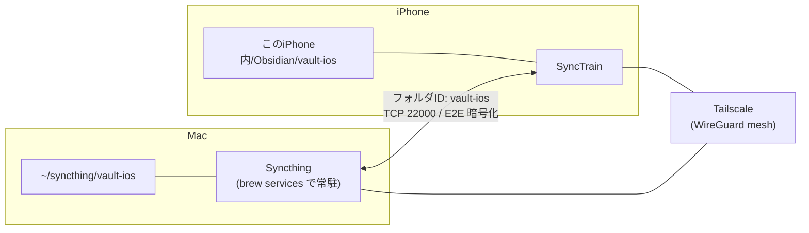

Mac の Obsidian Vault と iPhone の Obsidian を、iCloud も Obsidian Sync も使わずに同期させました。使ったのは Syncthing（Mac）、SyncTrain（iPhone）、Tailscale（両方）の 3 つで、いずれも追加費用はゼロです。同一 Wi-Fi 内だけでなく、外出先のモバイル回線からも同期することを確認しています。

ファイルはクラウドのサーバーに置かれません。端末同士が直接、エンドツーエンド暗号化された経路で交換します。

## 完成する構成



役割分担はこうなっています。

| コンポーネント | 役割 |
| --- | --- |
| Syncthing (Mac) | 同期の本体。デーモンとして常駐し、Web UI で設定する |
| SyncTrain (iPhone) | iOS 向けの Syncthing クライアント。Obsidian の Vault フォルダを直接掴む |
| Tailscale | LAN 外から端末同士を直結させる VPN。Syncthing の中継サーバーを不要にする |

Syncthing のバージョンは v2.1.1（Homebrew の `syncthing` formula）、Tailscale は 1.98.9 で確認しました。

## iCloud を使わない理由

Obsidian の iOS 版は、Vault を iCloud Drive 配下に置く選択肢を最初に出してきます。これを選ぶと Vault の実体が iCloud のコンテナ管理下に入るため、SyncTrain 側から「既存のフォルダ」として素直に掴めません。仮に掴めたとしても、iCloud と Syncthing の 2 系統が同じファイルを書き換えることになり、競合ファイルの発生源が増えます。

同期経路は 1 本に絞るのが安全です。そのため iPhone 側の Vault は「iCloud に保存」をオフにして、端末ローカル（`このiPhone内/Obsidian/<Vault名>`）に作ります。

Obsidian Sync（公式・有料）でも同じことはできます。それを選ばなかったのは、Vault の同期先に Linux サーバーや VPS を後から足したいときに、Syncthing なら同じ仕組みのまま台数を増やせるからです。

## 設計判断: Vault 丸ごとではなく iPhone 用のサブセットを別フォルダにする

今回同期しているのは Mac の本体 Vault（約 2,800 ファイル）ではなく、`~/syncthing/vault-ios` という独立した軽量 Vault です。この切り分けには理由があります。

- **iPhone で開くノートは限られる**。デイリーノートと Inbox が中心で、全ファイルを端末に持たせる必要がない
- **`.obsidian` の設定を共有すると事故る**。Mac 側で使っているプラグインの多くは iOS 非対応で、設定ごと同期すると起動時に問題が起きやすい
- **競合の発生面積が小さくなる**。同時に編集されうるファイルが減るほど、`sync-conflict` の掃除が減る

Syncthing には `.stignore` による選択的同期（SyncTrain では「selective sync」）もあり、大きいフォルダから一部だけを端末に置くこともできます。それでもフォルダを分けたのは、Obsidian 側の設定（プラグイン・テーマ・ホットキー）まで独立させたかったからです。

代償として、本体 Vault と iPhone 用 Vault の間でノートを移すのは手作業になり、Vault をまたぐ Wikilink は解決されません。「iPhone は書き込み口、整理は Mac」という運用に割り切っています。

## 手順 1: Mac に Syncthing を入れて常駐させる

```bash
brew install syncthing
brew services start syncthing
brew services list | grep syncthing   # started になっていること
```

Web UI を開きます。

```bash
open http://127.0.0.1:8384
```

:::message
待ち受けアドレスは既定で `127.0.0.1:8384`、つまり同じマシンからしか開けません（[公式 FAQ](https://docs.syncthing.net/users/faq.html) に明記されています）。LAN の他マシンから触りたい場合だけ設定を変更し、そのときは GUI 認証と HTTPS も併せて有効にします。
:::

メニューバーから操作したい場合は、GUI ラッパーの `syncthing-macos` を使う手もあります。設定は結局この Web UI で行うので、常駐だけが目的なら `brew services` で足ります。


## 手順 2: Mac 側に同期用フォルダを作る

```bash
mkdir -p ~/syncthing/vault-ios
```

本体 Vault の中に作らないのがポイントです。Obsidian が Vault 内の別 Vault を検出して混乱しますし、本体側の同期対象にも入ってしまいます。

## 手順 3: iPhone の Obsidian で iCloud オフの Vault を作る

まだ入れていなければ [Obsidian](https://apps.apple.com/jp/app/obsidian-connected-notes/id1557175442) を App Store から入れておきます。

1. Obsidian を起動する
2. 「Create new vault（新しい Vault を作成）」を選ぶ
3. **「iCloud に保存」をオフにする**（ここが本題）
4. Vault 名を入力して作成する。Mac 側のフォルダ名と揃えると後で迷いません（今回は `vault-ios`）

これで端末内に次の構造ができます。

```text
このiPhone内
└── Obsidian
    └── vault-ios
```

iPhone 標準の「ファイル」アプリから `このiPhone内 > Obsidian > vault-ios` として見えます。この実体を、次の手順で SyncTrain に掴ませます。

## 手順 4: Tailscale を Mac と iPhone に入れる

Tailscale は WireGuard ベースのメッシュ VPN です。同じアカウントでログインした端末同士が、NAT の内側にいても直接通信できるようになります。

- **Mac**: [公式サイト](https://tailscale.com/download)の macOS 版（standalone）または Mac App Store 版を入れる。`tailscale` コマンドを使いたい場合は standalone を選ぶ
- **iPhone**: App Store から Tailscale を入れる
- 両方を**同じアカウント**でログインさせる（同じ tailnet に入る）
- 管理コンソールで **MagicDNS を有効にする**。`macbook` のような短い名前で引けるようになり、IP が変わっても設定を直さずに済む

Mac 側で疎通を確認します。

```bash
tailscale status
```

```text
100.64.1.10  macbook   macOS   -
100.64.1.20  iphone    iOS     active; direct
```

ここで表示された Mac の名前（MagicDNS 名）か `100.x.y.z` を、手順 6 で Syncthing のアドレスとして使います。

:::message
Tailscale を挟むと、Syncthing 側の探索サーバー・中継サーバー（relay）に頼らずに端末同士が直結します。Syncthing の中継はそもそも中身を読めない設計ですが、経路を自分の tailnet 内に閉じられるのは素直な利点です。
:::

## 手順 5: SyncTrain を iPhone に入れて設定する

[SyncTrain](https://apps.apple.com/jp/app/synctrain/id6553985316) を App Store から入れます。オープンソース（[pixelspark/sushitrain](https://github.com/pixelspark/sushitrain)）で、iOS と macOS の両方に対応しています。

### 「Syncthing サービス」を使うかどうか

初回起動時に「Syncthing サービスを利用する / 利用しない」を選ばされます（後から変更可）。ここで言う Syncthing サービスとは、Syncthing Foundation が運営する次の 2 つです。

- **探索サーバー（Global Discovery）**: デバイス ID から相手の現在のアドレスを引く
- **中継サーバー（Relay）**: 直接繋がらないときに通信を中継する

どちらもファイルの中身は見えません。実ファイルは端末間でエンドツーエンド暗号化されて流れ、探索・中継はその経路を仲介するだけです。「Syncthing のサーバーにデータが保存される」という話ではありません。

今回は Tailscale で経路を確保するので **利用しない**を選びました。ただしこの選択には副作用があります（手順 6 で扱います）。

### フォルダを追加する

「最初のフォルダを追加する」から、

1. **フォルダ ID** に `vault-ios` と入力する
2. フォルダの種類で **「既存のフォルダ」** を選び、`このiPhone内 > Obsidian > vault-ios` を指定する


:::message alert
フォルダ ID は**共有する全デバイスで完全に一致**していなければならず（大文字小文字も区別）、**後から変更できません**。Mac 側と綴りを揃えて入力します。
:::

### デバイス ID を確認する

Mac 側から接続するために、SyncTrain のデバイス ID を確認します。QR コードとしても表示されるので、Mac の Web UI からカメラで読ませることもできます。


:::message alert
デバイス ID はパスワードではありません。ただし公式 FAQ に「**探索サーバーが有効なら、デバイス ID からそのデバイスの IP アドレスを引ける**」と明記されています。ブログやスクリーンショットに載せるなら伏せておくのが無難です。QR コードは同じ ID をエンコードしているので、文字列だけ塗っても意味がありません（この記事の画像は QR ごと塗り潰しています）。
:::

なお上の画像は macOS 版 SyncTrain で撮っていますが、iOS 版も画面構成は同じです。

## 手順 6: Mac 側でデバイスを承認し、フォルダを共有する

Mac の Web UI に戻ります。

### 接続先デバイスを追加する

「接続先デバイスを追加」を開くと、同一 LAN にいれば「近くに検出されたデバイス」として ID が並びます。ここから選べば ID の手入力は不要です。


**アドレスの扱いが分かれ目です。**

- **同一 LAN で使うだけなら `dynamic` のまま**で繋がります。ローカル探索（UDP 21027 のブロードキャスト）が相手を見つけてくれます
- **LAN 外から使うなら、静的アドレスを入れる**必要があります。手順 5 で「Syncthing サービスを利用しない」を選んだ場合、iPhone 側は探索サーバーに問い合わせないため、相手のアドレスを自力で知る手段がありません

静的アドレスは **iPhone 側に Mac のアドレスを入れる**のが確実です。Mac は常時起動していてホスト名が安定している一方、iPhone は電波環境でアドレスが変わります。SyncTrain の Mac デバイス設定に、Tailscale の名前でこう書きます。

```text
tcp://macbook:22000
```

MagicDNS を使わない場合は `tcp://100.64.1.10:22000` のように Tailscale IP を直接指定します。

### フォルダを追加して共有する

「フォルダーを追加」で、手順 2 で作ったパスと、iPhone 側と同じフォルダ ID を入れます。


フォルダの種類は既定の **送受信** のままにします（片方向にすると、iPhone で書いたノートが Mac に返りません）。

「共有」タブで iPhone のデバイスにチェックを入れます。


:::message
チェックボックスの隣にある「信頼しない場合、暗号化パスワードを入力」は untrusted device 向けの機能です。相手を信頼しないまま暗号化した状態だけを預けたいとき（レンタルサーバーなど）に使います。自分の iPhone なら空欄でかまいません。
:::

### ファイルのバージョン管理を入れておく

同期は削除も伝播させます。片方で消したノートは、もう片方からも消えます。保険として「ファイルのバージョン管理」を有効にしておきます。


**期間別バージョン管理（Staggered）／最大保存日数 90 日**にしました。置き換え・削除されたファイルはタイムスタンプ付きで `.stversions` ディレクトリに退避され、直近 1 時間は 30 秒ごと、1 日は 1 時間ごと、30 日は 1 日ごと、それ以降は 1 週間ごとの粒度で保持されます。

`.stversions` や `.stfolder` は Syncthing が自分の管理ファイルとして扱うため、同期対象から自動的に除外されます。設定は不要です。

## 手順 7: 疎通を確認する

Mac の Web UI で、iPhone が「同期中」から「最新」に変われば繋がっています。


フォルダを展開すると、フォルダ ID・パス・種類（送受信）・バージョン管理の設定・共有先デバイスがまとめて確認できます。


ここまで来たら、実ファイルで往復させます。

1. **Mac → iPhone**: `~/syncthing/vault-ios/test1.md` を作る。iPhone の Obsidian で開けることを確認する
2. **iPhone → Mac**: iPhone 側でノートを 1 行編集する。Mac の Finder / Obsidian に反映されることを確認する
3. **LAN 外**: iPhone の Wi-Fi を切ってモバイル回線にし、Tailscale をオンにしたまま 1 と 2 を繰り返す


3 まで通れば完成です。ここまで確認しました。

## つまずきやすい点

### iOS のバックグラウンド同期は保証されない

SyncTrain の README にあるのは "background synchronization (**to the extent possible**)" という表現です。iOS はバックグラウンド実行を OS 側が制限するため、アプリを閉じた直後に必ず同期が完了するとは限りません。

実用上は「**iPhone で書いたら、SyncTrain を開いて同期完了を確認してから閉じる**」を習慣にするのが確実です。Mac 側は常駐デーモンなので、この非対称性は iPhone 側だけの問題になります。

### `.obsidian/workspace.json` が競合し続ける

Obsidian は開いているペインやタブの状態を `.obsidian/workspace.json` に保存します。これは端末ごとに異なるのが当然のファイルなので、同期対象に入れると延々と競合します（[Obsidian フォーラム](https://forum.obsidian.md/t/slow-app-load-times-and-workspace-sync-conflicts-when-using-syncthing/44853)や [Syncthing フォーラム](https://forum.syncthing.net/t/obsidian-conflicts/19101)でも報告されています）。

フォルダ設定の「無視するファイル名」に入れておきます。

```text
.DS_Store
.obsidian/workspace.json
.obsidian/workspace-mobile.json
.trash
```

今回は Vault を分けたことで `.obsidian` 自体を共有していませんが、本体 Vault を丸ごと同期する構成にするなら必須の設定です。

### `sync-conflict` ファイルの掃除

両端で同じノートを触ると、Syncthing は片方を次の名前で残します。

```text
デイリーノート.sync-conflict-20260727-211146-XXXXXXX.md
```

自動マージはされません。最も安いのは「片方で編集する前に、もう片方の同期が終わっているのを確認する」という運用です。それでも溜まってしまったら、Obsidian の [File Diff](https://github.com/friebetill/obsidian-file-diff) プラグインで差分を見ながら潰していけます。

### Mac がスリープすると同期が止まる

Syncthing は Mac 上のデーモンなので、Mac がスリープ・電源オフの間は iPhone からの同期先が消えます。常時同期が要るなら、同じ構成の Syncthing を VPS に置いて三角形にするのが定石です。今回はそこまでやっていません。

## セキュリティで詰めておくこと

### GUI 認証

Web UI は既定で `127.0.0.1:8384` にしか待ち受けないので、外部から叩かれる状態にはなりません。ただし同じ Mac に複数ユーザーがいる環境では、他ユーザーからは開けます。スクリーンショットに写っている緑色のバナーはその警告です（この環境では未設定のままにしています）。

### デバイス ID とスクリーンショット

前述のとおり、デバイス ID は秘密ではないものの、探索サーバー経由で IP に辿れます。記事化のときに実際にやったのは次の 4 点です。

- デバイス ID の全文（8 ブロック）を塗る
- **QR コードも塗る**（同じ ID をエンコードしているため）
- ホスト名（`<機種名>-<ユーザー名>.local` の形で写る）を差し替える
- `/Users/<ユーザー名>` を含むパス表示を差し替える

Syncthing の Web UI はホスト名をヘッダーと「このデバイス」カードの 2 か所に出すので、片方だけ塗ると残ります。

### Tailscale 側

tailnet に他人の端末を入れていないなら追加設定は不要ですが、共有している場合は ACL でポート 22000 を絞れます。

## この構成の限界

- **iPhone から本体 Vault の全文検索はできない**。同期しているのはサブセットなので、Mac 側の 2,800 ファイルは iPhone に無い
- **iPhone のバックグラウンド同期は OS 制約で保証されない**
- **Mac がオフだと止まる**。常時稼働が要るなら VPS を足す構成になる

「移動中の入力口を確保する」という目的に対しては、これで十分に機能しています。

## 参照

- [Syncthing Documentation ─ FAQ](https://docs.syncthing.net/users/faq.html)
- [SyncTrain（App Store）](https://apps.apple.com/jp/app/synctrain/id6553985316) / [pixelspark/sushitrain（GitHub）](https://github.com/pixelspark/sushitrain)
- [Tailscale Download](https://tailscale.com/download)
- [Syncthing on iOS/iPadOS ─ Syncthing Community Forum](https://forum.syncthing.net/t/syncthing-on-ios-ipados/24610)
- [Syncthing on iOS: How to Make Möbius Sync and Synctrain Actually Work ─ Port & Patch](https://portandpatch.com/tech-guides/syncthing-ios-mobius-sync-synctrain-obsidian/)
