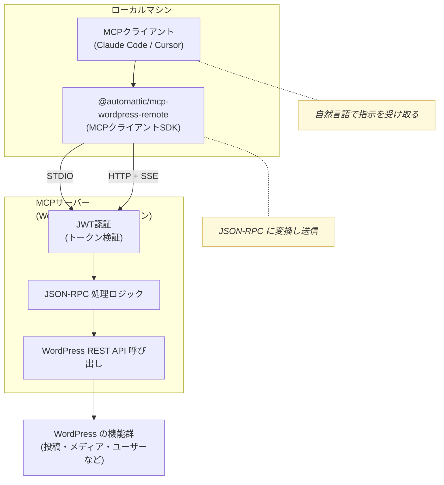

- [Automattic/wordpress-mcp - Github](https://github.com/Automattic/wordpress-mcp?tab=readme-ov-file)

WordPress MCP を使うことで、AI との自然な対話で WordPress を操作できるようになります。AI エージェントを介することで、管理画面で何度もクリックを重ねて行わなければできない作業や複数の作業を連続して実行(バッチ処理)できるようになります。

開発元は WordPress.com を運営する Automattic 社。JWT 認証による堅牢なセキュリティシステムと詳細な監査ログ機能により、企業レベルでも安心して使えそうです。

:::message
2025-06-16 時点の情報です。開発初期の状態なので、この後、多くの変更が入る可能性が高いです。
:::

## WordPress MCP を使ってできること

WordPress を API (JSON-RPC 2.0) 経由で操作できるようになります。

- 投稿の作成、編集、削除
- コメントの取得・承認・削除
- メディアのアップロードと取得
- ユーザーの作成、更新、削除
- プラグインの管理 (インストール・有効化・無効化)
- テーマの管理 (インストール・有効化・無効化)
- ナビゲーションメニューの管理
- サイト情報の取得・更新

### できないこと

- 複雑なレイアウト

### １．自然言語で指示（MCPクライアントが JSON‑RPC に変換）

AIとの会話で、例えば `最新の公開投稿5件を表示して` と言葉で指示するだけで、MCPクライアントが自動で JSON‑RPC 形式に変換し、API 経由で WordPress に適用します。

### ２．JSON‑RPC形式で直接命令

直接JSON‑RPC形式でメソッドとパラメータを指定することも可能。精密な制御や自動化スクリプトなどに。

## ツール

wordpress-mcp/includes/Tools の各ファイルにあるものを抜き出した。
(2025-06-16 時点)

- McpPostsTools.php
  - `wp_posts_search`: WordPressの投稿を検索し、ページネーションでフィルタリングする
  - `wp_get_post`: IDでWordPressの投稿を取得する
  - `wp_add_post`: 新しいWordPress投稿を追加する
  - `wp_update_post`: IDでWordPress投稿を更新する
  - `wp_delete_post`: IDでWordPress投稿を削除する
  - `wp_list_categories`: WordPressの投稿カテゴリを一覧表示する
  - `wp_add_category`: 新しいWordPress投稿カテゴリを追加する
  - `wp_update_category`: WordPress投稿カテゴリを更新する
  - `wp_delete_category`: WordPress投稿カテゴリを削除する
  - `wp_list_tags`: WordPressの投稿タグを一覧表示する
  - `wp_add_tag`: 新しいWordPress投稿タグを追加する
  - `wp_update_tag`: WordPress投稿タグを更新する
  - `wp_delete_tag`: WordPress投稿タグを削除する
- McpPagesTools.php
  - `wp_pages_search`: WordPressの固定ページを検索し、ページネーションでフィルタリングする
  - `wp_get_page`: IDでWordPressの固定ページを取得する
  - `wp_add_page`: 新しいWordPress固定ページを追加する
  - `wp_update_page`: IDでWordPress固定ページを更新する
  - `wp_delete_page`: IDでWordPress固定ページを削除する
- McpUsersTools.php
  - `wp_users_search`: WordPressのユーザーを検索し、ページネーションでフィルタリングする
  - `wp_get_user`: IDでWordPressユーザーを取得する
  - `wp_add_user`: 新しいWordPressユーザーを追加する
  - `wp_update_user`: IDでWordPressユーザーを更新する
  - `wp_delete_user`: IDでWordPressユーザーを削除する
  - `wp_get_current_user`: 現在ログイン中のユーザーを取得する
  - `wp_update_current_user`: 現在ログイン中のユーザーを更新する
- McpMediaTools.php
  - `wp_list_media`: WordPressのメディアを一覧表示し、ページネーションとフィルタリングを行う
  - `wp_get_media`: IDでWordPressメディアの詳細を取得する
  - `wp_get_media_file`: WordPressメディアの実ファイル（バイナリ）を取得する
  - `wp_upload_media`: WordPressに新しいメディアファイルをアップロードする
  - `wp_update_media`: WordPressメディアを更新する
  - `wp_delete_media`: WordPressメディアを完全に削除する（force=trueが必要）
- McpCustomPostTypesTools.php
  - `wp_list_post_types`: 利用可能なWordPressカスタム投稿タイプを一覧表示する
  - `wp_cpt_search`: WordPressのカスタム投稿を検索し、ページネーションでフィルタリングする
  - `wp_get_cpt`: IDでWordPressカスタム投稿を取得する
  - `wp_add_cpt`: 新しいWordPressカスタム投稿を追加する
  - `wp_update_cpt`: IDでWordPressカスタム投稿を更新する
  - `wp_delete_cpt`: WordPressカスタム投稿を削除する
- McpSettingsTools.php
  - `wp_get_general_settings`: WordPressの一般サイト設定を取得する
  - `wp_update_general_settings`: WordPressの一般サイト設定を更新する
- McpRestApiCrud.php
  - `list_api_functions`: CRUD操作をサポートするWordPress REST APIエンドポイントを一覧表示する（利用可能なAPI機能を確認する際に最初に使用）
  - `get_function_details`: 指定したREST APIエンドポイントとHTTPメソッドの詳細メタデータを取得する（パラメータ、必須項目、認証要件、応答構造など）
  - `run_api_function`: エンドポイント、HTTPメソッド、パラメータを指定してREST API関数を実行する（GET/POST/PATCH/DELETEに対応）
- McpWooProducts.php
  - `wc_products_search`: WooCommerce商品の検索とページネーションでのフィルタリングを行う
  - `wc_get_product`: IDでWooCommerce商品を取得する
  - `wc_add_product`: 新しいWooCommerce商品を追加する
  - `wc_update_product`: IDでWooCommerce商品を更新する
  - `wc_delete_product`: IDでWooCommerce商品を削除する
  - `wc_list_product_categories`: WooCommerce商品カテゴリを一覧表示する
  - `wc_add_product_category`: 新しいWooCommerce商品カテゴリを追加する
  - `wc_update_product_category`: WooCommerce商品カテゴリを更新する
  - `wc_delete_product_category`: WooCommerce商品カテゴリを削除する
  - `wc_list_product_tags`: WooCommerce商品タグを一覧表示する
  - `wc_add_product_tag`: 新しいWooCommerce商品タグを追加する
  - `wc_update_product_tag`: WooCommerce商品タグを更新する
  - `wc_delete_product_tag`: WooCommerce商品タグを削除する
  - `wc_list_product_brands`: WooCommerce商品ブランドを一覧表示する
  - `wc_add_product_brand`: 新しいWooCommerce商品ブランドを追加する
  - `wc_update_product_brand`: WooCommerce商品ブランドを更新する
  - `wc_delete_product_brand`: WooCommerce商品ブランドを削除する
- McpWooOrders.php
  - `wc_orders_search`: WooCommerceの注文一覧を取得する
  - `wc_reports_coupons_totals`: WooCommerceクーポン総計レポートを取得する
  - `wc_reports_customers_totals`: WooCommerce顧客総計レポートを取得する
  - `wc_reports_orders_totals`: WooCommerce注文総計レポートを取得する
  - `wc_reports_products_totals`: WooCommerce商品総計レポートを取得する
  - `wc_reports_reviews_totals`: WooCommerceレビュー総計レポートを取得する
  - `wc_reports_sales`: WooCommerce売上レポートを取得する
- McpSiteInfo.php
  - `get_site_info`: サイト名、URL、説明、管理者メール、プラグイン、テーマ、ユーザーなどWordPressサイトの詳細情報を取得する

## アーキテクチャー図



## 設定

### 1. インストール

1. [Releases - Automattic/wordpress-mcp - Github](https://github.com/Automattic/wordpress-mcp/releases/)から最新版の wordpress-mcp.zip をダウンロードして解凍
2. plugin ディレクトリにアップロード
3. WordPress ダッシュボードで WordPress MCP を有効化
4. 設定 > MCP で ”Enable MCP functionality” を有効化し、”Enable xxx Tools" を全て有効化

:::message alert
2025-06-16 現在、プラグイン、McpRestApiCrud.php の `list_api_functions` でエラーが出ていたので、修正が必要だった。多分すぐに修正されると思う。

誤: `'properties' => new \stdClass(),`
正: `'required'   => array(),`
:::

### 2. 認証のセットアップ

MCPクライアントで使う JWT(JSON Web Token) を生成する

1. 設定 > MCP > Authentication Tokens に移動
2. トークン期間（1〜24時間）を選択。今回は24時間に
3. "Generate New Token” をクリックすると、JWT が生成されるのでコピーし控えておく

:::message
JWT認証のトークンの有効期間は最大24時間。JWTの代わりに WordPress ユーザー名/パスワード を使えば無期限となるがセキュリティは下がる。
:::

### 3. MCPクライアントの設定

今回は、Claude Desktop 用に設定。
設定方法は WordPress の 設定 > MCP > Documentation からも参照できる。

`claude_desktop_config.json` に以下の設定を足す。
`”env"` (環境変数) の値を環境に合わせて変更(※ユーザーディレクトリは絶対パスで。`~` や `$HOME` はダメ)。
Claude Desktop を再起動して設定を反映。

```
{
 "mcpServers": {
  "wordpress-mcp": {
   "command": "npx",
   "args": [ "-y", "@automattic/mcp-wordpress-remote@latest" ],
   "env": {
    "WP_API_URL": "https://your-site.com/",
    "JWT_TOKEN": "前のステップで生成したJWT",
    "LOG_FILE": "/Users/ユーザー名/mcp-wordpress-remote.log"
   }
  }
 }
}
```

#### オプションの環境変数 (“env” に追加)

前者２つは ”JWT_TOKEN"の代わりに使える(セキュリティは下がる)。後者２つは、WooCommerce MCPアセットを使用する場合

- "WP_API_USERNAME": "WordPressユーザー名"
- "WP_API_PASSWORD": "WordPressパスワード"
- “WOO_CUSTOMER_KEY”: “WooCommerce 顧客キー
- “WOO_CUSTOMER_SECRET”: “WooCommerce 顧客秘密キー

### 4. カスタム指示

AI に覚えといて欲しいことを記憶させておく。
Claude Desktop なら、プロジェクトを作成し、カスタム指示をセット。
エディタならプロジェクトのルールファイルでセットしておく。

```
- スラッグ名は英語で付けてください
- 投稿でクラッシックブロックの使用は禁止
- ユーザーが会話で質問した時は、承認なしでの実行は禁止
- ★★TODO: 他を追加
```

---

## 使い方

AI チャットで、会話で指示を開始。
まずは、MCP で WordPress を操作することを明示しておこう。

`WordPress MCP を使って、WordPress を操作します。`

### 自然言語で指示するサンプル

※うまくいかないものもあるかも

#### 投稿関連

- 今週のニュースまとめ」というタイトルで新しい投稿を作成して。カテゴリーは「ニュース」、タグは「週間まとめ、2024年6月」で、下書き状態で保存して。
- 会社の「サービス紹介」ページを作成して。親ページは「会社案内」に設定し、メタディスクリプションも追加して公開状態にして。
- 最新の公開投稿5件を表示して
- 投稿タイトルを『夏キャンペーン』にして内容を下書きで保存して
- 投稿ID42を公開済みに更新して
- 2025年5月の投稿のうち、下書きの一覧を見せて
- 指定したURLから画像をアップして ‘夏バナー’ というaltテキストを設定して

#### 分析、レポート

- 過去3ヶ月で最もコメントが多い記事トップ10を教えて
- 全記事を調査して、内部リンクが少ない記事をリストアップして
- 最新の10記事を取得して、タイトルが30文字以下のもの、メタディスクリプションが未設定のもの、アイキャッチ画像がないものをレポートして。
- 過去3ヶ月の投稿を分析して、最も使用されているカテゴリートップ5と、各カテゴリーの記事数を教えて。
- 月次レポート自動作成

    ```
    先月のサイト活動レポートを作成して：
    - 新規投稿数
    - 新規ユーザー登録数
    - 最も閲覧された記事トップ5
    - 新しく追加されたメディアファイル数
    ```

- コンテンツ品質チェック**

    ```
    最近公開された記事で以下をチェック：
    - 文字数が500文字以下の記事
    - 外部リンクが含まれていない記事
    - カテゴリーが未設定の記事
    ```

#### メディア操作

- メディアライブラリから「2024年6月」に追加された画像をすべて取得して、ALTテキストが設定されていないものをリストアップして。
- アップロードされている PDF ファイルをすべて表示して、ファイルサイズが 5MB 以上のものを特定して。
- 今追加した記事のアイキャッチ画像として<https://unsplash.com/ja/%E5%86%99%E7%9C%9F/%E4%BA%BA%E3%81%AF%E3%81%9F%E3%81%8F%E3%81%95%E3%82%93%E3%81%AE%E6%B5%AE%E3%81%8D%E8%BC%AA%E3%82%92%E6%B5%B7%E3%81%AB%E9%81%8B%E3%81%B3%E3%81%BE%E3%81%99-m6XLDPXyUVU> を適用して。(Unsplash の無料写真をアイキャッチ画像に設定。ただし直リンクでメディアライブラリへの保存はできない。後で外部画像を取り込むプラグインはある。)

#### ユーザー・権限

- 管理者権限を持つユーザーをすべて表示して、最終ログイン日時も含めて一覧にして。
- 投稿者権限のユーザーで、過去6ヶ月間投稿がないユーザーを特定して。
- 編集者権限のユーザーで、今月まだ投稿していない人を特定して
- 新しいエディター ‘assistant\_user’ を作成して
- ユーザー 'editor123' の権限を管理者に変更して
- ユーザー一覧からメールアドレスが'@example.com'のユーザーを表示して

#### プラグイン・テーマ

- ⭕️最近追加されたプラグインのセキュリティ状況を確認して
- 有効化されているプラグインで更新が利用可能なものをリストアップして、セキュリティ関連のプラグインを優先的に表示して。
- Enable Media Replace プラグインをインストールして有効にして
- Akismetプラグインを有効にして
- テーマ twentytwenty を現在のテーマとして有効化して

#### コメント管理

- 投稿ID42の保留中コメントを取得して
- コメントID88を承認して

#### サイト管理

- WordPress のサイトヘルス情報を取得して、重要な問題がないかチェックして。
- メディアライブラリで容量の大きいファイルを特定して、最適化の提案をして。
- 接続されているサイト一覧を表示して。
- サイト名を 'myblog' に切り替えて。
- 「お知らせ」カテゴリーの記事をすべて取得して、CSV形式でエクスポート用のデータを準備して。
- 古いドメインから新しいドメインへのURL変更で、すべての投稿内のリンクを一括で更新して。

#### WooCommerce 管理

- 在庫が10個以下の商品をすべて表示して、商品名、在庫数、最終更新日を含めた一覧を作成して。
- 今月の注文データを取得して、売上上位5商品と総売上金額を教えて。

#### コンビネーションの例

処理を組み合わせることで、複雑な処理を一気に行うことができるのが大きなメリット。

##### プラグインを探してインストール

- 自分：日本語運用で必須のプラグイン、なんだっけ？
- AI：WP Multibyte Patch。インストールしますか？
- 自分：お願い。有効化もして。

##### プロフィール作成支援をしてもらい、固定ページに投稿

- 自分：私のプロフィールの固定ページを作成したい。足りない情報があれば聞いて。
- AI：質問 / 自分：回答
- 自分：この内容で「プロフィール」ページを作成して公開状態にして。

### 無理だったもの

- チャットの添付画像をメディアライブラリにアップロード
- ローカルにある画像ファイルを直接指定してのアップロード
- 画像 '<https://xxx.com/img/hoge.png>' をメディアライブラリに登録して
- Astra テーマを適用したい

### JSON‑RPC形式で直接命令するサンプル

#### 投稿作成

```json
{
  "jsonrpc":"2.0",
  "method":"create_post",
  "params":{
    "title":"AIによる記事サンプル",
    "content":"<p>これは自動生成された記事です。</p>",
    "status":"draft"
  }
}
```

#### 投稿取得

```json
{
  "jsonrpc":"2.0",
  "method":"list_posts",
  "params":{"status":"publish","per_page":10}
}
```

#### 投稿更新

```json
{
  "jsonrpc":"2.0",
  "method":"update_post",
  "params":{"id":18,"title":"更新済みタイトル","content":"<p>更新された本文</p>"}
}
```

#### メディア掲載

```json
{
  "jsonrpc":"2.0",
  "method":"upload_media",
  "params":{
    "file_url":"https://example.com/img.jpg",
    "title":"サンプル画像",
    "alt_text":"説明文"
  }
}
```

#### ユーザー操作

```json
{
  "jsonrpc":"2.0",
  "method":"create_user",
  "params":{
    "username":"new_editor",
    "email":"new@example.com",
    "role":"editor",
    "password":"secure123"
  }
}
```

#### プラグイン制御

```json
{
  "jsonrpc":"2.0",
  "method":"activate_plugin",
  "params":{"plugin":"akismet/akismet.php"}
}
```

---

## 悩ましいところ

### ブロックエディタで組んだページの編集は難しそう

コードの書き換えでブロックが壊れることが多々発生する。しっかりとした仕様書を作りうまく指示してやれば、ブロックでのレイアウト組みやデザインの多少の改善などもできそうに思ったが、ブロックは単純なものでもコード量が多く、数度の読み取りや編集で Claude のコンテキストウィンドウ上限に達してしまい実用的ではなさそうに思った。クラッシックエディター、もしくは HTML ブロックに全部詰め込む方法なら柔軟な編集が可能そうだが、それがいいことなのか…。

---

## 応用 (未チェック)

- **MCP機能の拡張**: プラグインやテーマに新しいツールクラスを作成することでMCP機能を拡張できる。
- **カスタムリソースの追加**: 独自のプラグインまたはテーマからカスタムリソースを追加することにより、MCP機能を拡張できます。プラグインまたはテーマに新しいリソースクラスを作成します。
